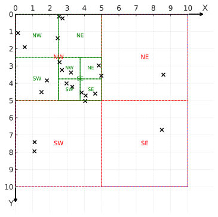
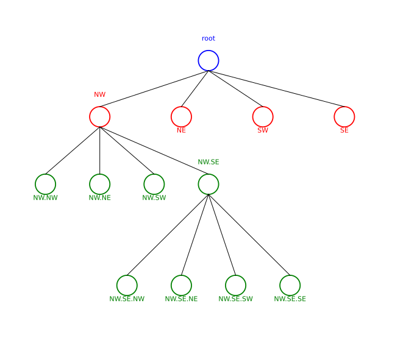
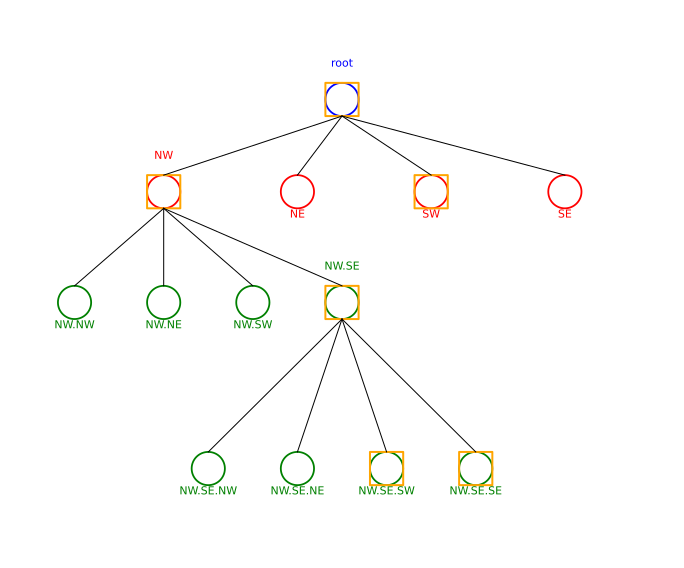

# GOKQ

*aka "Golang kjkrol QuadTree"*

The library provides a [Quadtree](https://en.wikipedia.org/wiki/Quadtree) data structure  
for efficient spatial indexing and 2D range queries.

**Powered by [`gokg`](https://github.com/kjkrol/gokg) toolkit:** the tree understands both bounded and cyclic planes.
Queries grazing a cyclic edge automatically wrap and
fragment their search regions, so neighbour lookups stay accurate even when the area
straddles the boundary.

# QuadTree

A spatial tree used for searching in a two-dimensional space. Formally defined as:

$$
Q =
\begin{cases}
\text{leaf}(S), & \text{if } |S| \le L \\
(Q_{NE}, Q_{NW}, Q_{SE}, Q_{SW}), & \text{otherwise}
\end{cases}
$$

Which reads as: if a node contains more than L elements, create four children and distribute the elements among them.

### Quadtree that stores points on a plane
Assume the tree root represents the plane’s AABB (axis-aligned bounding box). Let’s introduce the subdivision rules for a node:
- The node’s AABB $Q$ splits into four equal AABBs representing fragments of the parent, i.e. $\{Q_{NE}, Q_{NW}, Q_{SE}, Q_{SW}\}$.
- Each element is moved to the appropriate newly created leaf so that it lies within that leaf’s AABB.

The illustrations below show example points placed on the plane and stored in a quadtree. As more points are added, the area is split into smaller fragments.
<div style="display: flex; justify-content: center; gap: 4%; align-items: stretch; margin: 0 auto;">
  <figure style="flex: 1; margin: 0; text-align: left; display: flex; flex-direction: column;">
	
	<figcaption style="flex: 1; margin-top: 0.5rem;">Splitting the plane into fragments and further subdivisions; colored outlines show fragment boundaries, and points lie in their AABBs. This is where the quadtree “geometry” happens.
	<br>Where point density is higher, the area is subdivided more: for example, region SE contains one point—no further subdivision is needed. In region NW, subdivision occurs, followed by a further subdivision of NW.SE.</figcaption>
  </figure>
  <figure style="flex: 1; margin: 0; text-align: left; display: flex; flex-direction: column;">
	
	<figcaption style="flex: 1; margin-top: 0.5rem;">Graph representation of the same split: labeled nodes illustrate fragments (e.g., NW.SE), and edges illustrate the subdivision history = the inheritance structure of tree nodes.</figcaption>
  </figure>
</div>

## Usage example

```go
package main

import (
	"fmt"

	"github.com/kjkrol/gokg/pkg/geometry"
	"github.com/kjkrol/gokq/pkg/qtree"
)

type point struct {
	box geometry.BoundingBox[float64]
	id  string
}

func newPoint(id string, x, y float64) *point {
	pos := geometry.NewVec(x, y)
	return &point{
		box: geometry.NewBoundingBoxAt(pos, 0, 0),
		id:  id,
	}
}

func (p *point) Bound() geometry.BoundingBox[float64] { return p.box }
func (p *point) Id() string                           { return p.id }

func main() {
	plane := geometry.NewCyclicBoundedPlane[float64](64, 64)
	tree := qtree.NewQuadTree(plane)
	defer tree.Close()

	for _, pt := range []*point{
		newPoint("edge", 63.0, 63.0),
		newPoint("wrap-x", 1.0, 63.0),
		newPoint("wrap-y", 63.0, 1.0),
	} {
		tree.Add(pt)
	}

	target := newPoint("target", 63.5, 63.5)
	for _, neighbor := range tree.FindNeighbors(target, 2.0) {
		fmt.Printf("%s -> %v\n", neighbor.Id(), neighbor.Bound())
	}
}
```

For more scenarios, explore the example-based tests in `pkg/qtree`, which double as runnable docs.


## How does a Quadtree speed up searching?

### Searching points on a plane
Imagine we have N points on a plane. We want to check whether points collide or are within a given distance `d` of each other. For every pair ${(X_1, Y_1), (X_2, Y_2)}$ we would need to perform the following check:

$$
\sqrt{(X_1-X_2)^2+(Y_1-Y_2)^2} < d
$$

To do this we must compare all ordered pairs, with repetition allowed. In mathematical terms: “we are looking for the number of length-2 variations on a set of N elements.” The number of variations with repetition is given by $N^k$

where `N` is the number of available elements and `k` is the sequence length.

In summary: the naive approach would require checking every possible pair of objects, i.e. $N^2$ distance checks.

It would be better to compare each pair only once—order does not matter (“collision A with B is the same as B with A”). So we want the number of combinations without repetition $\binom{N}{k}$.

In our case, we are looking for “the number of ways to choose 2 elements from a set of N different elements, without repetition and without considering order.”

$$
\binom{N}{2} = \frac{N!}{2!(N-2)!} = \frac{N(N-1)}{2}
$$

We obtained a result half as large, but the algorithmic complexity is still on the order of $O(N^2)$.

### Searching a quadtree
If we place all points from the plane into a quadtree, we can leverage the tree structure to greatly speed up searching.

<div style="display: flex; justify-content: center; gap: 4%; align-items: stretch; margin: 0 auto;">
  <figure style="flex: 1; margin: 0; text-align: left; display: flex; flex-direction: column;">
	
	<figcaption style="flex: 1; margin-top: 0.5rem;">For a selected point marked in orange, we look for neighbors inside the orange square neighborhood. We search for points inside a given AABB centered at the chosen point x.</figcaption>
  </figure>
  <figure style="flex: 1; margin: 0; text-align: left; display: flex; flex-direction: column;">
	
	<figcaption style="flex: 1; margin-top: 0.5rem;">Tree search checks whether the query AABB intersects a node’s AABB.
	<br>For this case:
	<ul>
	  <li>the root check is positive</li>
	  <li>we check its children; those with a positive result are outlined in orange</li>
	  <li>we recursively continue checking the children of nodes that tested positive until we reach leaves</li>
	</ul>
	</figcaption>
  </figure>
</div>

#### Quadtree search algorithm

```
Search(Q, queryAabb):
  if Q.aabb does not intersect queryAabb:
	return ∅

  if Q is a leaf:
	return all points p ∈ Q.points such that p ∈ queryAabb

  // internal node – check only children whose AABB intersects the query
  result ← ∅
  for child C in {Q_NE, Q_NW, Q_SE, Q_SW}:
	if C.aabb intersects queryAabb:
	  result ← result ∪ Search(C, queryAabb)
  return result
```

In short: we discard whole subtrees whose AABB does not intersect the query area; in leaf nodes we filter points with an AABB membership test. This cuts down the checks to the subtrees actually intersecting the search area.

**Search complexity.**

Let $N$ be the number of points. The maximum number of nodes intersected by the AABB at one level is 4.

The tree height is $h = \log_{4}{N}$.

The number of nodes visited in the entire operation is $\leq 4*h = 4\log_{4}{N}$.

Thus the time to traverse the whole tree is $\leq O(4\log_{4}N)$

Taking into account that we have to perform distance tests for each of the up to 4 points stored in every leaf:

$$
O(4\log_{4}{N} + 4)
$$

Dropping constants (the 4s), the algorithmic complexity of searching the tree is:

$$
O(\log{N})
$$

This is a much better result than blindly comparing every pair of points, which remember has complexity $O(N^2)$.

----
*[Contributor Recommendations](docs/Contributor_Recommendations.md)
